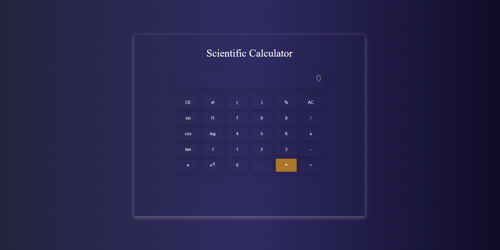

  <h1 align="center">Travel - Travel & Tour Website</h1>

 Responsive for all devices, built using HTML, CSS, and JavaScript.

  <a href="https://keerti1924.github.io/Scientific-Calculator/"><strong>➥ Live Demo</strong></a>

 

## 📃 Description

 Scientific Calculator is used to perform advanced scientific calculations such as finding exponents, logs, factorial, etc.
 Simply choose the function you want from the menu screen and then do the operation of your choice.
 
 

 

1) It's easy, lightweight and super fast to start, ideal for some daily calculation needs.
2) Easy to use user main menu.
3) Various features.

👉 **Operations :-** This scientific calculator can perform the following operations which are listed below: 

- Square root
- Percentage
- Factorial
- Constants (pi, e)
- Exponent
- log base 2, 10, e
- Power
- Sin, Tan, Cos (angle in degrees )

👉 **Create the scientific calculator with the help of these three files to perform the above operations**

- **index.html :-** This file contains the skeleton structure of the calculator
- **style.css :-** This file contains the styling of the calculator
- **script.js :-** This file contains the logic to perform the calculations

## 🚀 Setup/Installation Requirements

To view the website, 
* click [Scientific Calculator](https://github.com/keerti1924/Scientific-Calculator.git)
or 
* copy the link https://github.com/keerti1924/Scientific-Calculator.git paste it to your browser and load it.  

## 🛠 Built With

* HTML
* CSS
* JAVASCRIPT

📱 Moreover, I've ensured that the website is fully responsive on all screens, making it accessible and user-friendly across various devices. 📱💡

## 🤝 Contributing 

Contributions, issues, and feature requests are welcome! Feel free to check the [issues page](/issues).

## ⭐️ Show your support 

Give a ⭐️ if you like this project!

## 📝 License

This project is **free to use** and does not contains any license.
